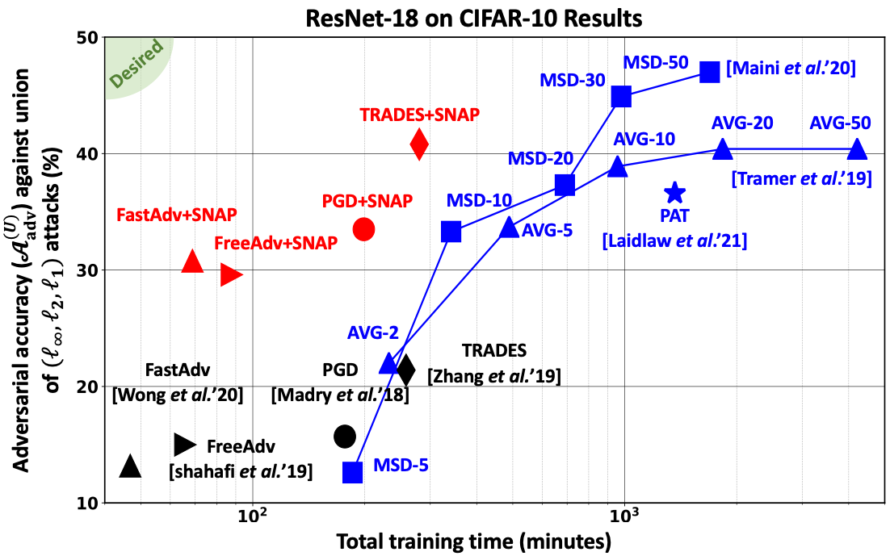
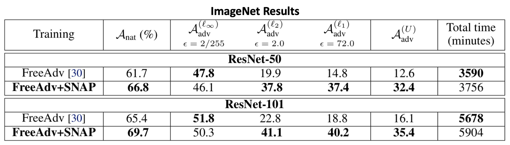

# SNAP: Robustifying *l<sub>&infin;</sub>* Adversarial Training to the Union of Perturbation Models

This repository contains the code and pretrained models necessary for reproducing results in our recent preprint: 

**Robustifying *l<sub>&infin;</sub>* Adversarial Training to the Union of Perturbation Models** <br>
*Ameya D. Patil, M. Tuttle, Alexander G. Schwing, Naresh R. Shanbhag, University of Illinois at Urbana-Champaign (UIUC)* <br> 
Paper: [https://arxiv.org/abs/1702.06119](https://arxiv.org/abs/1702.06119)

## Short Summary \& Results: 

* Classical adversarial training (AT) frameworks are designed to achieve high adversarial accuracy against a single attack type, typically *l<sub>&infin;</sub>* norm-bounded perturbations. Recent extensions in AT have focused on defending against the union of multiple perturbation models but this benefit is obtained at the expense of a significant (up to 10X) increase in training complexity over single-attack *l<sub>&infin;</sub>* AT.

* In this work, we expand the capabilities of widely popular single-attack *l<sub>&infin;</sub>* AT frameworks to provide robustness to the union of (*l<sub>&infin;</sub>*, *l<sub>2</sub>*, *l<sub>1</sub>*) perturbations, while preserving the training efficiency of single-attack *l<sub>&infin;</sub>* AT.

* Our technique, referred to as Shaped Noise Augmented Processing (SNAP), exploits a well-established byproduct of AT frameworks -- the reduction in the curvature of the decision boundary of networks. SNAP prepends a given deep net with a shaped noise augmentation layer whose distribution is learned along with network parameters using any standard single-attack AT. 

* As a result, SNAP enhances adversarial accuracy of ResNet-18 on CIFAR-10 against the union of (*l<sub>&infin;</sub>*, *l<sub>2</sub>*, *l<sub>1</sub>*) perturbations by 14%-to-20% for four state-of-the-art (SOTA) single-attack *l<sub>&infin;</sub>* AT frameworks (PGD, [TRADES](https://github.com/yaodongyu/TRADES), [FreeAdv](https://github.com/mahyarnajibi/FreeAdversarialTraining), [FastAdv](https://github.com/locuslab/fast_adversarial)) as shown in the plot below. SNAP augmentations achieve the highest adversarial accuracy when training time is <12 hours on a single Tesla P100 GPU. 

* Thanks to its simplicity, efficiency, and scalability, SNAP augmentation of [FreeAdvTraining](https://github.com/mahyarnajibi/FreeAdversarialTraining) establishes a first benchmark for ResNet-50 and ResNet-101 networks robust to union of (*l<sub>&infin;</sub>*, *l<sub>2</sub>*, *l<sub>1</sub>*) perturbations on ImageNet. 

* SNAP is very easy to integrate into any given single-attack *l<sub>&infin;</sub>* AT framework to improve its effectiveness against the union of (*l<sub>&infin;</sub>*, *l<sub>2</sub>*, *l<sub>1</sub>*) perturbations.
<p align="center">

</p>
<p align="center">

</p>

## This Repository:

### Overview

Here we share our code to reproduce SNAP results on both CIFAR-10 (Table 2 in the paper) and ImageNet (Table 4 in the paper). We also share corresponding pretrained models to facilitate quick reproduction of our results. 

Importantly, these codes illustrate how SNAP can be employed in a given training setup with minimal modifications and no additional hyperparameter tuning. 

The repository is organized in the following folders: 
```
- ReadMe (this file)
- CIFAR10/ 
	- PGD/
		- TrainedModels/
	- TRADES/
		- TrainedModels/
- ImageNet/
```
Sub-folders PGD/, TRADES/ in CIFAR10/ contain all the python files to evaluate the pretrained models (stored in TrainedModels/) or to train the new models. 

For ImageNet, kindly find our pretrained ResNet-50 model [here](https://drive.google.com/drive/folders/1RLl4xPa-tVDsx33iGpX4pXTuPuYnlvoj?usp=sharing). We evaluated the ```epoch25``` model in the above ImageNet results table. Files to evaluate the pretrained models and train new models can be found in ImageNet/.

### Getting Started: 

To clearly illustrate example usage, we provide shell scripts (.sh) that execute all training and evaluation python codes sequentially with appropriate arguments to reproduce the results for CIFAR-10 (Table 2 in the main text) and ImageNet (Table 4 in the main text). The evaluation scripts are configured to load our PreTrained models. Those scripts are listed below. 

	CIFAR10/PGD: Reproduce_Table2_PGD.sh 

	CIFAR10/TRADES: Reproduce_Table2_TRADES.sh 

	ImageNet/: Reproduce_Table4_FreeAdv.sh 


### Points to note: 

	- ImageNet dataset directory: All ImageNet python codes have a default ImageNet dataset directory. That 'dataset-dir' argument needs to be provided appropriately. 
	- For ImageNet, the pretrained model needs to be downloaded seperately at the link above. Furthermore, one needs to set the 'model-dir' arguement appropriately in the attack evaluation codes. 
	- In order to execute .sh scripts, one needs to make them executable first. For example, to make Reproduce_Table2_PGD.sh an executable file, type ``chmod a+x Reproduce_Table2_PGD.sh'' in the command line. Then, run it via the command  ``./Reproduce_Table2_PGD.sh''.
	- All python/shell scripts are assumed to be executed in their current directory. 

## Contact and Citation Information 

If you face any issues in running these codes or if you have any questions about this work, please feel free to contact me at [adpatil2@illinois.edu](adpatil2@illinois.edu). I'm more than happy to help!

If you find the paper or the code useful for your research, please consider citing it as follows:
```bash
@article{patil2021snap,
  title={Robustifying $\ell_\infty$ Adversarial Training to the Union of Perturbation Models},
  author={Patil, Ameya and Tuttle, Michael and Schwing, Alexander and Shanbhag, Naresh },
  journal={arXiv preprint arXiv:xxxx.xxxx},
  year={2021}
}
```

## Acknowledgements

Parts of the code in this repository are based on following awesome public repositories: 

* [http://github.com/locuslab/smoothing](http://github.com/locuslab/smoothing)
* [https://github.com/locuslab/robust_union](https://github.com/locuslab/robust_union)
* [https://github.com/yaodongyu/TRADES](https://github.com/yaodongyu/TRADES)
* [https://github.com/ashafahi/free_adv_train](https://github.com/ashafahi/free_adv_train)
* [https://github.com/locuslab/fast_adversarial](https://github.com/locuslab/fast_adversarial)
